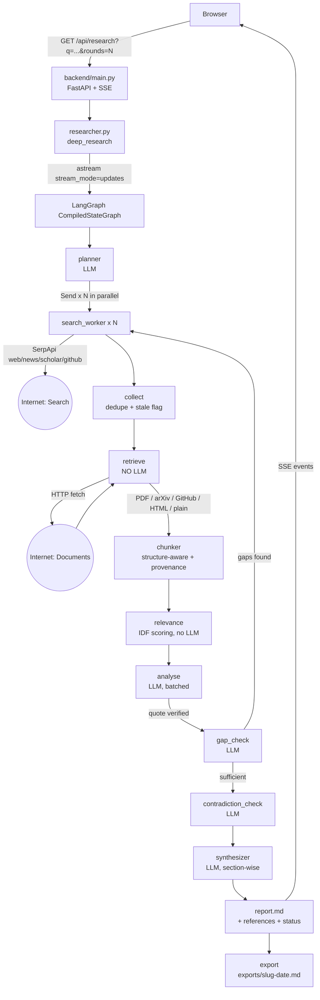
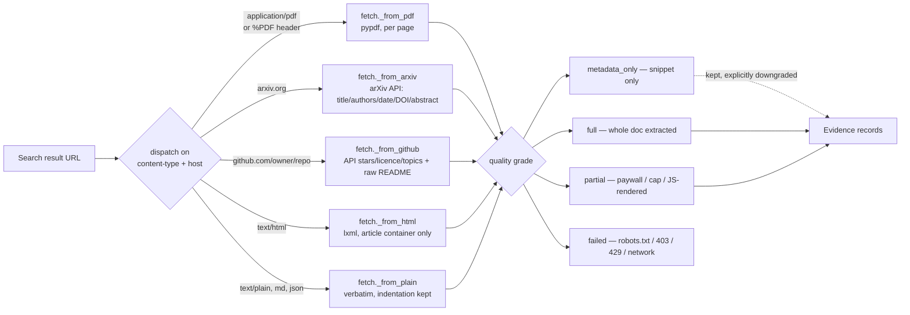
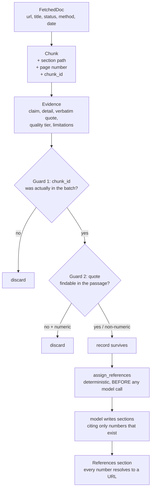
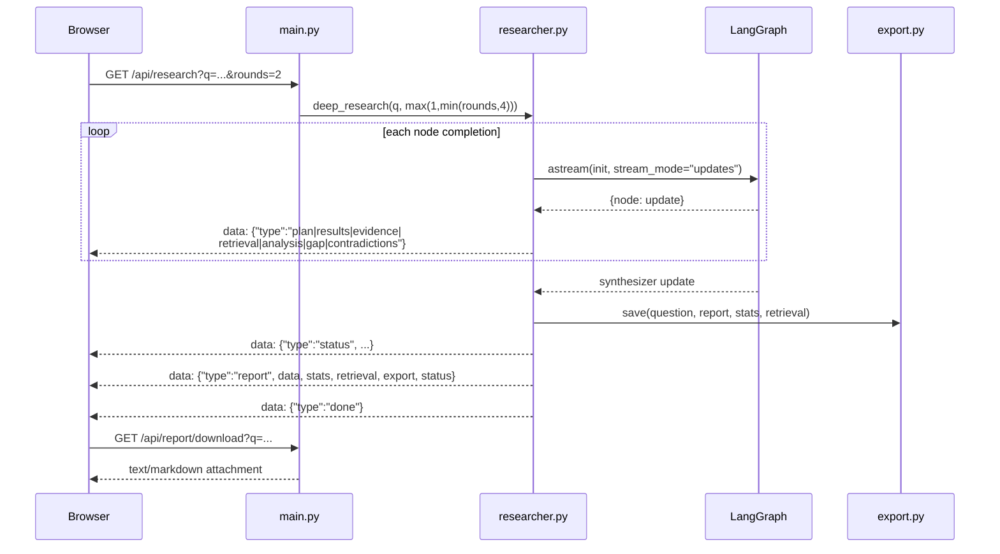

# Deep Researcher — System Design

> **Source of truth.** Branch `dev-dxhize-v2` at `ea0ead2`, which includes the
> v2 pipeline (merged to `main` via PR #16 as `c83ddde`) plus request pacing,
> configurable research depth, incremental analysis and sub-question dedup.
>
> Line counts and symbols are read from `ea0ead2`.

Companion documents sit alongside this file:

| Document | Contents |
|---|---|
| [`README.md`](./README.md) | Hub, navigation, how to read the set |
| [`01-Architecture.md`](./01-Architecture.md) | Layers, graph topology, why LangGraph is used |
| [`02-File-Reference.md`](./02-File-Reference.md) | Every file, its public API, its responsibility |
| [`03-Data-Stream.md`](./03-Data-Stream.md) | Byte-level journey from internet to markdown, with parallel branches |
| [`04-Configuration.md`](./04-Configuration.md) | Every tunable, default, and what it trades away |
| `DeepResearcher.canvas` | Obsidian canvas — open for a visual layout |

---

## 1. What the system does

Given a question, it plans searches, runs them in parallel, **downloads and parses the real documents behind the results**, extracts verifiable evidence with provenance, reconciles disagreements, and writes a long traceable report where every citation resolves to a URL a human can open.

The design premise: *a search snippet is a pointer, not a source.* Everything downstream is built to distinguish what was actually read from what was merely advertised.

---

## 2. High-level flow



---

## 3. The eight graph nodes

Measured node order from `astream(stream_mode="updates")` on a real run:

```
planner → search_worker ×7 → collect → retrieve → analyse → gap_check
        → contradiction_check → synthesizer
```

| Node | LLM? | Responsibility |
|---|---|---|
| `planner` | ✅ 1 call | Question → 3–5 sub-questions, each with web/news/scholar/github searches |
| `search_worker` | ❌ | One SerpApi query → normalised rows. **Fanned out in parallel via `Send`** |
| `collect` | ❌ | Dedupe by normalised URL, flag rows ≥3 years old as stale |
| `retrieve` | ❌ | Download + parse real documents; bounded reference discovery |
| `analyse` | ✅ batched | Rank passages, extract evidence, verify quotes, per-source synthesis |
| `gap_check` | ✅ 1 call | Is there a *specific* gap worth another search round? |
| `contradiction_check` | ✅ batched | Genuine disagreements between extracted findings |
| `synthesizer` | ✅ ~14 calls | Section-wise report writing, reference numbering, completion state |

### What LangGraph actually does — and does not do

**Does:** DAG sequencing; parallel fan-out via `Send`; state merging via `Annotated[list, operator.add]` reducers; conditional routing; the `astream` that drives SSE.

Measured fan-out: 7 `search_worker` nodes from one `planner`, **peak concurrency 6**, threads `asyncio_0`–`asyncio_5` starting within 11 ms, **1.4 s wall vs 4.9 s sequential (~3.5× faster)**.

**Does not:** all substantive work. Retrieval, chunking, relevance, extraction, report writing and LLM fallback are plain Python called *inside* nodes. Notably the loop bound is **our own** `max_rounds` check in `gap_check`, not LangGraph's `recursion_limit` (verified: `max_rounds` 1/2/4 → `gap_check` runs 1/2/4 times and always terminates).

---

## 4. The three parallel branches

Retrieval is deliberately multi-strategy. Each source is dispatched to the best parser available.



The grade travels with the document into the report. A `metadata_only` source can be cited, but its evidence is forced to `weak` quality with confidence ≤ 0.3 and a limitation stating the document was **not** read.

---

## 5. Evidence provenance chain

The traceability guarantee is structural, not aspirational:



Because reference numbers are assigned from the evidence records **before any model runs**, a fabricated citation is structurally impossible — the model has no number available that isn't real.

---

## 6. Honest completion state

A report that lost sections is not a finished research run.

| Status | Meaning |
|---|---|
| `completed` | Every planned section was written |
| `partial` | Some sections missing; `missing_sections` names each and why |
| `failed` | No usable report |

Surfaced three ways: a `status` SSE event, the `report` event's `status` field, and a visible banner inside the markdown itself — so the **exported file** is also honest when reopened later.

```markdown
> **PARTIAL REPORT — LLM budget exhausted during synthesis**
> These planned sections could not be written and are absent from this report:
> Hiring Demand (LLM call budget exhausted).
```

---

## 7. Determinism budget

A deliberate design rule: **never spend an LLM call on something a parser can do reliably.**

| Task | Done by |
|---|---|
| HTML / Markdown parsing | `lxml` + `BeautifulSoup` |
| PDF text extraction | `pypdf` |
| URL normalisation, dedupe | `collector.py` |
| Section-aware chunking | `chunker.py` |
| Relevance scoring | `relevance.py` (IDF, no model) |
| Comparison target + dimension extraction | `relevance.py` (string work) |
| Reference numbering | `report.py` (dict ordering) |
| Evidence-by-Source table | `report.py` (metadata restatement) |
| Quote verification | `evidence.py` (word-overlap) |

LLM calls are spent only on: planning, gap judgement, evidence extraction, contradiction detection, and prose writing.

---

## 8. Request lifecycle



`error` then `done` are always the last frames on failure.

---

## 8a. Request pacing

Free-tier providers do not fail politely — one 429 can cost the rest of the day.
`throttle.py` spaces calls out rather than merely capping them, with two knobs:

| Setting | Default | Protects against |
| --- | --- | --- |
| `THROTTLE_LLM_PER_MINUTE` | 12 | per-minute token/request budgets |
| `THROTTLE_LLM_MAX_CONCURRENT` | 1 | two runs jointly exceeding one quota |

The throttle is a **process-wide singleton per kind** (`llm`, `search`), shared by
every run, because the quota belongs to the provider rather than to one request.
The UI has a *Request pacing* selector; `?throttle=0|1` applies to a single run
and then restores the configured default.

## 8b. Research depth and the budget coupling

`RESEARCH_MAX_ROUNDS` (default 2) with ceiling `RESEARCH_MAX_ROUNDS_LIMIT`
(default 10). Measured: each round costs ~13 model calls on top of a fixed ~17.

| rounds | calls needed |
| --- | --- |
| 2 | ~43 |
| 4 | ~69 |
| 6 | ~95 |
| 10 | ~147 |

`RESEARCH_LLM_BUDGET` **auto-sizes to the requested depth when unset**. Pinned
too low, the planner warns and the report returns `partial` — a starved budget
produces a shallower report, never a silently truncated one.

## 8c. Incremental analysis and sub-question dedup

Later rounds re-chunk the whole corpus, so `analyse` skips sources it has already
extracted from, re-reading one only when its retrieval grade *improves*. On 10
documents with 2 new per round: passages read went 10 → 22 → 36 → 52 before, and
10 → 12 → 14 → 16 after.

The planner deduplicates sub-questions using two signals with independent
thresholds (rare-term overlap, and character trigrams that catch rewordings), then
asks for replacements covering new ground. Measured on real plans, a reworded
duplicate scores ~0.61 while genuinely distinct dimensions score 0.05–0.09.

## 9. Scale of the current system

| Measure | Value |
|---|---|
| Backend + frontend source | ~5,400 lines across 20 active files |
| Tests | 228 passing (1 live, skipped offline) |
| Pipeline LLM calls per run | ~25–40, bounded by `RESEARCH_LLM_BUDGET` |
| Typical documents parsed | 15–25 |
| Typical evidence records | 40–130 |
| Typical report | 11,000–14,000 words, 19–39 references |

---

## 10. Known limitations

- **Roughly a third of search results are unreachable** — `robots.txt` disallows (Reddit, Facebook, LinkedIn), publisher bot protection (Medium, Indeed), or origin rate limits. Those become `metadata_only` and are flagged; no claim should lean on them.
- **No CI.** A workflow running `pytest -q -m "not live"` on each PR would have caught `main` shipping a frontend that called a deleted endpoint.
- **Provider quotas dominate quality.** A free-tier primary (Groq 8000 TPM, Gemini daily quota) forces fallback chains; prompts above ~8k tokens cannot be served by some models at all.
- **Learned prompt ceilings are per-process** and lost on restart.
- **No authentication** on the export download endpoint — fine locally, not for deployment.
- **Markdown renderer is hand-written** (`frontend/markdown.js`); it escapes everything and covers the constructs the report uses, but is not full CommonMark.
- **Search is SerpApi-only** — one paid engine, so no provider fallback.