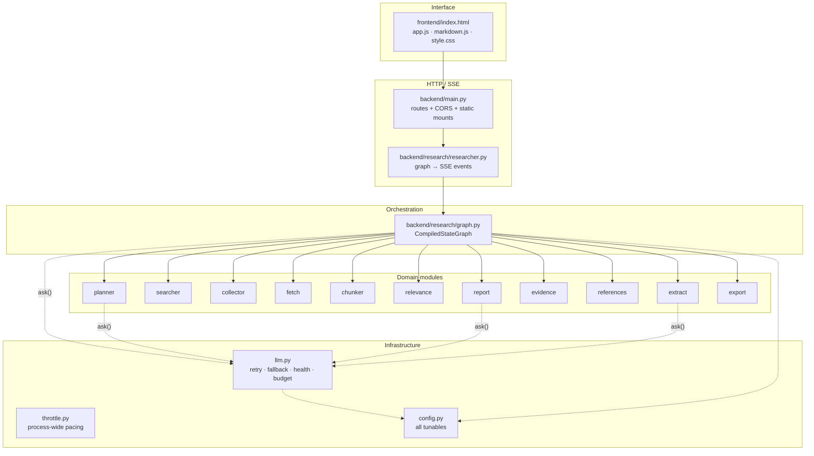
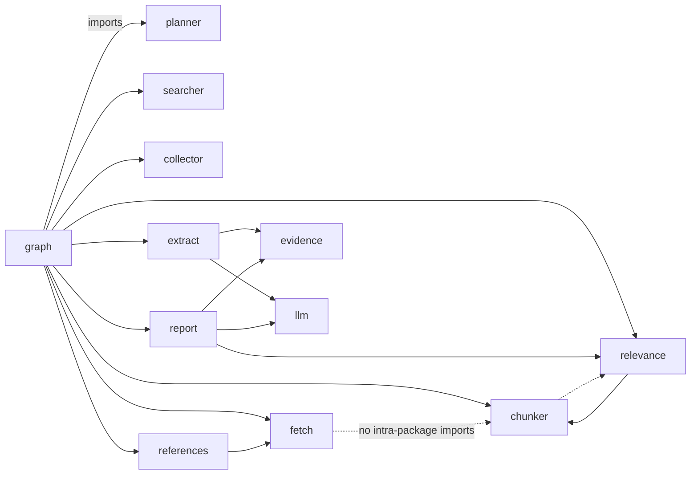

# 01 — Architecture

## Layer cake

Every cross-module call goes through `llm.ask()` if it needs a model, or through `config.*` for limits. No module reaches into another module's internals.

## Graph topology

Compiled from `graph.build_graph()`:

| From | To | Kind |
|---|---|---|
| `__start__` | `planner` | fixed |
| `planner` | `search_worker` | **conditional** (fan-out via `Send`, one per pending search) |
| `planner` | `retrieve` | **conditional** (no pending searches) |
| `search_worker` | `collect` | fixed (N workers converge) |
| `collect` | `retrieve` | fixed |
| `retrieve` | `analyse` | fixed |
| `analyse` | `gap_check` | fixed |
| `gap_check` | `search_worker` | **conditional** (gaps found → another round) |
| `gap_check` | `contradiction_check` | **conditional** (sufficient → finish) |
| `contradiction_check` | `synthesizer` | fixed |
| `synthesizer` | `__end__` | fixed |

> **Trap worth knowing:** `planner` and `gap_check` need *different* terminal routing. An early version shared one router function, so an empty `pending` list sent the graph back to `retrieve` forever and it recursed until LangGraph's limit. `route()` and `route_after_gap()` are separate for that reason, and `test_gap_check_terminates_when_no_follow_ups` pins it.

## Shared state

`State` is a `TypedDict(total=False)`. Three keys carry **reducers** so concurrent writes merge instead of overwriting:

| Key | Reducer | Why |
|---|---|---|
| `raw` | `operator.add` | 6 parallel workers each append search results |
| `log` | `operator.add` | same, one entry per worker |
| `notes` | `operator.add` | any node may contribute a pipeline note |

All other keys are last-write-wins. Two objects are carried by reference rather than copied:

| Key | Type | Purpose |
|---|---|---|
| `budget` | `CallBudget` | Shared LLM call ceiling, auto-sized to the requested depth |
| `fetcher` | `Fetcher` | Keeps the fetch budget **per run**, not per process |

### Accumulating across rounds

Three things must survive a second gap-check round, and they were each a bug first:

| Key | Behaviour |
|---|---|
| `retrieval_index` | `url → {status, method, words, title, limitation}`. A source already read is **never re-fetched**; a grade only ever improves |
| `extracted_sources` | `url → grade` already extracted, so later rounds skip it unless the grade improves |
| `documents_by_url` | `url → FetchedDoc` (best seen). Re-chunked from the union each round |
| `extracted` | Evidence records merged by `(claim[:80], source_url)` |

Without `retrieval_index`, round 2 re-requested URLs round 1 already had, exhausted `RESEARCH_FETCH_BUDGET`, marked everything `metadata_only`, and overwrote the statistics — so the UI showed `0 documents fetched` beside evidence that had come from fully-read PDFs. `_aggregate_retrieval()` now derives every counter from the single index, guaranteeing `attempted == full + partial + metadata_only + failed`.

## What LangGraph contributes

| Capability | Where it shows |
|---|---|
| DAG sequencing | The 8-stage order |
| Parallel fan-out | `Send("search_worker", p)` — measured peak concurrency **6**, ~3.5× faster than sequential |
| State merging | `operator.add` reducers make concurrent workers safe |
| Conditional routing | `route()`, `route_after_gap()` |
| Streaming | `astream(stream_mode="updates")` is what makes SSE possible |

## What LangGraph does **not** contribute

Worth being blunt about, because it shapes where bugs live:

- **All research capability is plain Python inside nodes.** Retrieval has its own `ThreadPoolExecutor`. Chunking, relevance scoring, evidence records, reference numbering and the evidence table are pure functions.
- **The loop bound is ours.** `gap_check` returns `pending: []` when `round >= max_rounds`. LangGraph's `recursion_limit` (25) is an unused backstop. Verified: `max_rounds` 1/2/4 → `gap_check` runs 1/2/4 times, always terminating.
- **Concurrency inside a node is not LangGraph's job.** `retrieve` and `analyse` run their own thread pools; the report is written sequentially by design, because section ordering must be deterministic.

If you removed LangGraph you would lose the fan-out and the state merging. Every research capability would survive as ordinary function calls.

## Failure containment

The pipeline is built so one bad input cannot kill a run:

| Failure | Containment |
|---|---|
| One search errors | Recorded in that worker's `results` event with `error` set; run continues |
| One URL 403/429/robots-blocked | `FetchedDoc(status=failed)`; others unaffected |
| One extraction batch fails | `try/except` around `ask()`; note recorded, other batches continue |
| One section cannot be written | Recorded in `missing_sections`; report marked `partial` |
| Every model fails | `LLMChainError` → `error` then `done` event |
| Programming error (`TypeError`) | **Propagates deliberately** — a bug should not look like a provider hiccup |

## Request pacing

`llm.ask()` and `searcher.search()` both wrap the outbound call in
`throttle.get(kind).slot()`. The pacer is a process-wide singleton per kind,
because a provider's quota belongs to the provider rather than to one request.

Two independent limits:

- `per_minute` spaces calls so the total sent in any window is bounded by
  construction — this is what protects a TPM budget
- `max_concurrent` bounds calls in flight. A single run is already sequential for
  model calls, so this exists for two browser tabs running pipelines at once,
  where each run's pacing looks correct in isolation while together they exceed
  a shared limit

`?throttle=0` on `/api/research` disables pacing for that run only and restores
the configured default in a `finally`, so one unthrottled request cannot
silently disable pacing for later runs.

## Dependency direction

`evidence.py` and `config.py` are leaves — they import nothing from the package. `llm.py` imports only `config.CHARS_PER_TOKEN`. Nothing imports `graph.py` except `researcher.py`.

## Legacy code still in the tree

`backend/tools/` (322 lines: `github.py`, `news.py`, `serpapi.py`) and `backend/evidence/collector.py` (44 lines) are the pre-LangGraph layer. **Nothing on the live path imports them** — `searcher.py` calls `serpapi.GoogleSearch` directly. They survive only because four test files (664 lines) exercise them in isolation. Roughly a third of the codebase, entirely off-path.