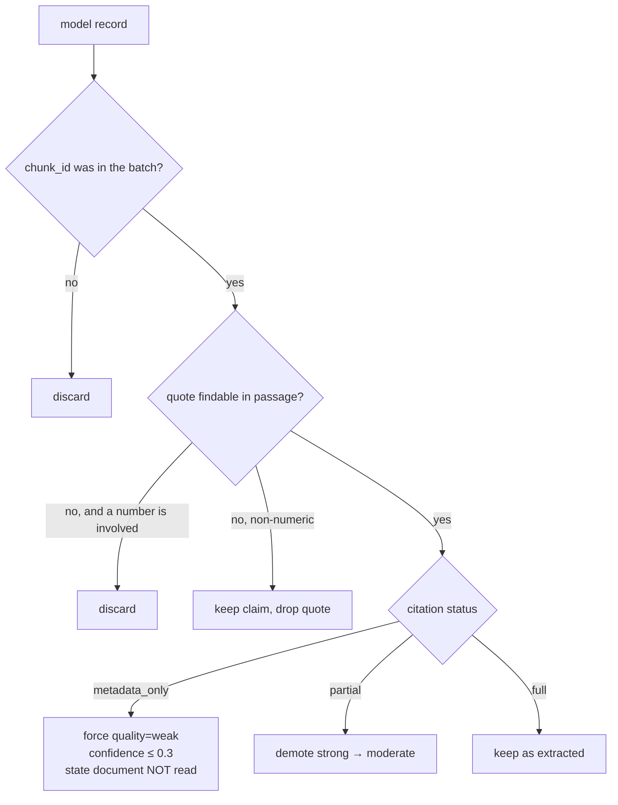
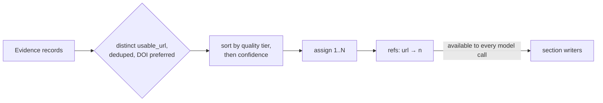

# 03 — Data Stream

The journey of the data itself, from the internet to the markdown a reader sees. Every quantity below is a real default from `config.py`.

## Stage 0 — Request arrives

```
GET /api/research?q=Compare%20React%20Native...&rounds=2
```

`rounds` clamped to 1–4. `deep_research(q, 2)` seeds the graph state: `question`, `max_rounds`, empty `raw`/`log`/`notes`, plus a fresh `CallBudget`.

---

## Stage 1 — Planning (1 LLM call)

**In:** the question string (~350 chars).
**Out:** `{"subquestions": [{"question", "searches": [{"source", "query"}]}]}`, typically 3–5 sub-questions × 2 searches = **7 searches**.

A realistic plan for the mobile-framework question:

| Sub-question | Searches |
|---|---|
| performance and app size in 2026? | `scholar`, `web` |
| developer productivity, ecosystem maturity, AI tooling? | `github`, `web` |
| maintenance costs and long-term support? | `web`, `news` |
| 2026 job market and hiring demand? | `news`, `web` |

`route()` converts each search into a `Send`, so all 7 become `search_worker` tasks.

---

## Stage 2 — Parallel search (no LLM)

**In:** 7 × `{source, query}`.
**Out:** 7 lists of `{title, url, snippet, date, type, query}`, ~6 rows each = **~42 rows**.

```
search_worker (×7, parallel — measured peak concurrency 6)
   └─ searcher.search() → SerpApi
        web     → google engine
        news    → google_news
        scholar → google_scholar
        github  → google + "site:github.com"
```

Each worker emits one `results` event carrying its count. A failing search records `error` and the run continues.

> Parallelism is real: 7 searches × 0.7 s instrumented = **1.4 s wall** against 4.9 s sequential.

---

## Stage 3 — Collect (no LLM)

**In:** ~42 raw rows.
**Out:** deduped, stale-flagged set — typically **35–61 unique URLs**.

Folds `www.` and trailing slashes, drops URL-less rows, flags anything ≥3 years old.

---

## Stage 4 — Retrieval (no LLM) — *the architectural centrepiece*

**In:** unique URLs. Already-read URLs are skipped via `retrieval_index`, so round 2 never re-downloads.
**Out:** `FetchedDoc` per URL, graded.

### The five parse branches, in parallel

| Branch | Trigger | Parser | Typical yield |
|---|---|---|---|
| PDF | `application/pdf` or `%PDF-` header | `pypdf`, per page | 6,000–14,000 words from a 15–27 page paper |
| arXiv | host `arxiv.org` | arXiv API, then abs page | authoritative title, authors, date, DOI, abstract |
| GitHub | `github.com/{owner}/{repo}` | REST API + raw README | stars, forks, licence, topics, last push + README |
| HTML | `text/html` | `lxml` + `BeautifulSoup` | article container only; headings, tables, code preserved |
| Plain | `text/plain`, `.md`, `.json` | as-is | verbatim, indentation kept |

Six worker threads (`FETCH_MAX_WORKERS=6`), one `Retry-After` retry on 429/5xx.

### Grading, which travels to the report

| Grade | Meaning | Typical cause |
|---|---|---|
| `full` | whole document extracted | — |
| `partial` | some of it | paywall marker, byte cap, PDF page cap, JS-rendered |
| `metadata_only` | only the search snippet | never fetched, or `robots.txt` / 403 / 429 |
| `failed` | nothing usable | robots.txt disallow, HTTP 403/429, network error |

Measured on a representative run: 67 attempted → 25 fetched (24 full, 1 partial), 42 metadata-only, **64,796 words** retrieved.

### Reference discovery (bounded)

Outbound links and DOIs from documents actually read → deterministic relevance score → top `REFERENCES_MAX=6`. Social/account-wall hosts skipped. Depth 1, so references are not chased recursively.

---

## Stage 5 — Chunking (no LLM)

**In:** document text + structural markers.
**Out:** `Chunk` objects, capped at `CHUNKS_PER_SOURCE=6` per document by even sampling.

HTML headings are re-emitted as `#`-prefixed markers during extraction, so the chunker rebuilds a **section path**; PDF page breaks are preserved as `\f`.

```
[Input]  ## Performance  ### UI frame rate  <paragraph>  | TTI | 1.2s |  <paragraph>
[Output] chunk_id=S3#2  section="Performance > UI frame rate"  page=0
```

A real PDF run produced chunks at pages **1, 4, 8, 12, 15, 20** with sections `Approach > Efficient implementation`, `Instruction Finetuning`, `Conclusion`, etc.

---

## Stage 6 — Relevance (no LLM)

**In:** chunks + question + plan.
**Out:** top `RELEVANCE_TOP_CHUNKS=70`, diversified across sources.

IDF-weighted term overlap over the corpus, with boosts for chunks covering a named dimension or containing quantitative claims, and a penalty for boilerplate. Reasons are recorded per chunk:

```
score 5.65  S1#0  query terms: app, native, performance, react
                 covers dimension 'performance'
```

---

## Stage 7 — Evidence extraction (batched LLM)

**In:** ranked chunks, minus any from a source already extracted in an earlier
round. A source is re-read only when its grade *improved* — a snippet that later
became a real document is new material; an unchanged full-text PDF is not.

Measured on 10 documents with 2 new per round, passages read:

| rounds | before | after |
| --- | --- | --- |
| 1 | 10 | 10 |
| 2 | 22 | 12 |
| 3 | 36 | 14 |
| 4 | 52 | 16 |
**Out:** `Evidence` records — typically **40–130** per run.

Chunks are packed to `EXTRACT_BATCH_CHARS=13,000`, capped at `EXTRACT_MAX_BATCHES=14`. One call yields every finding those chunks support — throughput per call, not one call per fragment.

### Payload shape

```
[P1] id=S1#3
  title: …   url: …   publisher: … | published: 2026-01-01
  section: Ecosystem maturity | page 4
  retrieval: full
  TEXT: …~13,000 chars total across the batch…
```

### Record shape

```json
{"evidence": [{
  "chunk": "S1#3",
  "claim": "Cold start on a mid-range Android device measured 1.8s in this benchmark",
  "detail": "Release build, Pixel 7, 20 iterations",
  "quote": "measured 1.8s in this benchmark",
  "dimension": "performance",
  "quality": "moderate",
  "confidence": 0.7
}]}
```

### Two deterministic guards



These caught **4 fabricated citations** in a single real run, and the rejection count is surfaced in the `analysis` event's notes rather than hidden.

### Per-source synthesis

Several sources per call → what each source genuinely establishes, what a reader might wrongly assume it supports, and its weight. **9 individually assessed sources** on the reference run.

---

## Stage 7a — Sub-question deduplication

The plan is filtered before any search runs. Duplicates consume a parallel search
slot and skew the evidence base — the same material retrieved and cited twice
while another dimension goes unresearched.

```
4 sub-questions
   ↓ _clean_plan          drop malformed; drop any with no usable search
   ↓ dedupe_subquestions  two signals, independent thresholds
   │   · rare-term overlap (IDF-weighted)  ≥ 0.70  → hard restatement
   │   · character trigrams                 ≥ 0.45  → same question reworded
   ↓ rejected list
   ↓ regenerate            ask for replacements covering new ground
   ↓ dedupe again          replacements can collide too
   ↓ on any failure         surviving plan used unchanged
```

Calibration on real plans: a reworded duplicate scores **0.61**, genuinely
distinct dimensions **0.05–0.09**, so 0.45 sits in a wide gap.

## Stage 8 — Gap check (1 LLM, rounds − 1 times)

**In:** question + dimensions + extracted findings (preferred) or snippets (fallback).
**Out:** `{sufficient, missing, follow_ups ≤ 3}`.

```
Still researching.
Missing: Benchmarks comparing app size and performance (FPS, memory usage) of each
```

New searches are filtered against `seen`, so nothing is repeated. `round >= max_rounds` stops the loop — our own bound, not LangGraph's.

---

## Stage 9 — Contradiction detection (batched LLM)

**In:** findings in ~11,000-char batches.
**Out:** `{topic, side_a, side_b, sources_a, sources_b, likely_cause, more_general}` — **10 contradictions** on the reference run.

The prompt distinguishes a genuine disagreement from a difference explained by date, configuration, workload or scope. The detector is imperfect — it occasionally reports "A: X / B: X" for a duplicated claim, and surfaces that explanation rather than hiding it.

---

## Stage 10 — Synthesis (~14 LLM calls)

### Reference numbering happens first, deterministically



**No model has run yet.** A citation the model invents has no number to reference. Fabrication becomes structurally impossible rather than merely discouraged.

### Section-by-section writing

Sections come from the dimensions extracted in Stage 6 (7 in the reference run) plus the fixed ones:

| Section | Evidence slice | `min_words` |
|---|---|---|
| Executive Summary | all records (or top-40) | 450 |
| Scope and Methodology | all | 350 |
| One per dimension (7) | `_select_for_dimension` | 700 |
| Where the Evidence Conflicts | conflict findings | 500 |
| Scenario Analysis | all | 600 |
| Decision Framework | all | 500 |
| Evidence Quality and Limitations | all | 400 |
| Conclusion | all | 400 |

Each call receives only its relevant evidence, which is what keeps a citation attached to the claim it actually supports.

### Completion state

```
missing_sections[] recorded per section:
  "Hiring Demand (LLM call budget exhausted)"
  "Executive Summary (every model in the chain failed)"
        │
        ▼
classify_status()  →  completed | partial | failed
        │
        ├─► ReportResult.status
        ├─► SSE "status" event (before the body)
        ├─► SSE "report".status
        ├─► banner inside the markdown
        └─► frontend banner + report-card class
```

---

## Stage 11 — Output

### In the browser

`markdown.js` escapes everything, then renders structure. Autolinks survive escaping, citations become `#ref-N` anchors, and the References section emits **one** `<ol>` with sequential numbering.

### On disk

`exports/<slug>-<date>.md`

```markdown
---
title: "Compare React Native, Flutter, and native Android development…"
generated: 2026-10-04
sources: 19
findings: 118
full_text_sources: 24
words_retrieved: 64796
---
```

Served back via `GET /api/report/download` as an attachment — a browser cannot write to disk, and nothing tries to work around that.

---

## Reference run, end to end

| Stage | Input | Output |
|---|---|---|
| Plan | 1 question | 7 searches across 4 sub-questions |
| Search | 7 queries | ~42 rows, 7 workers in parallel |
| Collect | 42 rows | 61 unique URLs |
| Retrieve | 61 URLs | 25 fetched (24 full, 1 partial), 64,796 words, 135 chunks, 6 references followed |
| Relevance | 135 chunks | 70 kept, diversified |
| Extract | 70 chunks | 110 verified findings, 7 dimensions |
| Synthesise sources | 110 findings | 9 assessed |
| Contradictions | 110 findings | 10 |
| Report | 110 findings | **13,402 words, 61 collected sources, 19 cited, 39 references** |
| Export | report | `exports/compare-react-native-…-2026-10-04.md` |